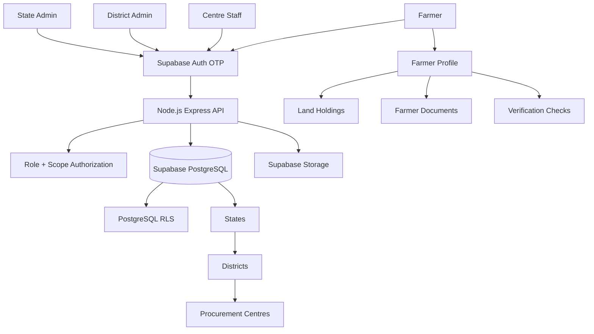

# KisanSetu / Procuremintra

Slot booking and procurement management for state paddy procurement centres.

**Status: Phases 1–12 built.** Registration and verification, dashboard, slot
booking, staff procurement, live status and queue, payment, voice booking,
location, notifications, analytics, feedback, and security hardening — all in
English and Tamil, plus booking-time AI quality assessment.

---

## What exists

| Concern | Decision |
| --- | --- |
| Database | Supabase PostgreSQL, one authoritative store |
| Authentication | Supabase Auth, phone OTP |
| Languages | English and Tamil |
| Roles | `FARMER`, `CENTRE_STAFF`, `DISTRICT_ADMIN`, `STATE_ADMIN` |
| Scope | Farmer → self · Staff → one centre · District admin → one district · State admin → one state |
| Authorization | Express middleware **and** PostgreSQL Row Level Security |
| Registration | Stepped flow with save/resume and a backend-only state machine |
| Farmer verification | **District admin** for their own district — never centre staff |
| Quality AI | Python service, advisory only; assessed at booking time, before travel |
| Documents | Private Supabase Storage bucket, signed URLs only |
| Audit | `audit_logs`, service-role writes only |



---

## Repository layout

```
packages/shared/      Role, language, status, model and error types
apps/api/             Node + Express + TypeScript API
apps/web/             React + Vite + TypeScript + Tailwind SPA
apps/web/src/i18n/    en.json, ta.json and the translation provider
apps/ml/              FastAPI quality-assessment service (Python)
apps/ml/training/     Model training; writes the artifacts the service loads
supabase/migrations/  SQL migrations (schema, RLS, storage)
docs/                 Registration guide and the Phase 1 audit
docker-compose.yml    ml + api + web, for a one-command local stack
```

The API follows one dependency direction:

```
route → controller → service → repository → Supabase
```

Route handlers contain no SQL and no business rules.

---

## Getting started

### Prerequisites

- Node.js 20.11+
- [Supabase CLI](https://supabase.com/docs/guides/cli) and Docker, **or** a
  hosted Supabase project

### 1. Install

```bash
npm install
npm run build -w @kisansetu/shared
```

`@kisansetu/shared` is consumed as a built package, so build it once before the
first `typecheck`, `dev` or `test`.

### 2. Start Supabase

```bash
supabase start
```

Keep the printed API URL, publishable/anon key and secret/service-role key. For
a hosted project, take the same three from **Project Settings → API**.

> **Key formats.** Newer Supabase projects issue `sb_publishable_…` and
> `sb_secret_…` keys instead of the legacy `anon` / `service_role` JWTs. They map
> onto the same two roles: publishable → `SUPABASE_ANON_KEY` (public, RLS
> applies), secret → `SUPABASE_SERVICE_ROLE_KEY` (privileged, bypasses RLS).
>
> Our column guards key off `auth.role() = 'service_role'`, written for the
> legacy JWTs. **Confirmed by test** that a `sb_secret_…` key still resolves to
> that role — `npm run verify` re-checks it empirically rather than trusting
> documentation. Had it not, the failure would have been silent.

### 3. Configure

```bash
cp .env.example .env
```

| Variable | Used by | Notes |
| --- | --- | --- |
| `SUPABASE_URL` | API | Project URL |
| `SUPABASE_ANON_KEY` | API | Public key; queries run under RLS |
| `SUPABASE_SERVICE_ROLE_KEY` | API | **Server only.** Bypasses RLS |
| `PORT` `NODE_ENV` `FRONTEND_URL` | API | |
| `APP_TIMEZONE` | API | Business timezone, default `Asia/Kolkata` |
| `MAX_UPLOAD_BYTES` | API | Document size limit, default 10 MB |
| `VITE_SUPABASE_URL` `VITE_SUPABASE_ANON_KEY` `VITE_API_URL` | Web | Public values only |
| `ML_SERVICE_URL` | API | Optional. Unset = manual quality only, nothing blocked |
| `BHASHINI_USER_ID` `BHASHINI_API_KEY` | API | Optional. Unset = voice booking uses the browser's own speech engine instead of Bhashini |
| `TWILIO_ACCOUNT_SID` `TWILIO_AUTH_TOKEN` | API | Optional. Unset = the IVR webhook runs but skips signature verification |
| `WEATHER_PROVIDER` | API | `open-meteo` (keyless) or `none` |
| `PAYMENT_PROVIDER` | API | Only `demo` exists; it moves no money |

`.env.example` lists the rest, each with what it is for.

The API refuses to start if the service-role key appears in any `VITE_`
variable, and the Vite build fails on the same condition.

### 4. Apply migrations

```bash
supabase db reset     # local
supabase db push      # hosted
```

**Without the CLI**, paste `supabase/bootstrap.sql` into the dashboard
**SQL Editor** and run it. That file is the migrations concatenated in order;
`supabase/migrations/` stays the source of truth.

### 5. Enable phone auth

Every login is phone OTP, so a project with the phone provider off cannot
authenticate anybody: **Authentication → Sign In / Providers → Phone** → enable.

Then configure an **SMS provider** (Twilio, MessageBird, Vonage or Textlocal)
on the same screen, so codes are actually delivered. That is the only way
anyone — farmer, centre staff, district or state admin — signs in.

*Test phone numbers* are fixed OTPs that bypass SMS. They belong to the local
test stack (`supabase/config.toml`, see *Test fixtures*) and to a throwaway
development project used with the demo dataset. **Never** add one to a project
real farmers use.

### 6. Seed and check

```bash
npm run seed      # reference data: states, districts, procurement centres
npm run verify    # schema, RLS, storage, key privilege, state machine
```

### 7. Run

```bash
npm run dev:api   # http://localhost:4000
npm run dev:web   # http://localhost:5173
```

The AI quality service is optional and runs separately — see
**[apps/ml/README.md](apps/ml/README.md)**.

### Or: the whole stack in one command

```bash
docker compose up --build
```

Brings up `ml` (8000), `api` (4000) and `web` (5173), with the API pointed at
the ML service automatically. Supabase stays external — compose reads the same
`.env` and contains no secrets of its own, so nothing in these files is
sensitive to commit.

The web image inlines `VITE_*` at **build** time, which is how Vite works: a
changed `VITE_API_URL` needs `--build`, not just a restart.

---

## The farmer journey

```
Language → Mobile → OTP → new/returning → Personal → Address → Land
        → Documents → Photo → Review → Submit → Status
```

Full detail, including the state machine and what each field is for, is in
**[docs/phase-1-registration.md](docs/phase-1-registration.md)**.

The product contains **no demo accounts, demo numbers, demo mode or demo OTP
instructions**. `noPrototypeBehaviour.test.ts` scans `apps/api/src` and
`apps/web/src` and fails the build if any reappear.

---

## Provisioning government accounts

Staff and admin accounts are never self-registered:

```bash
npm run provision -w @kisansetu/api -- \
  --role CENTRE_STAFF --phone +919876543210 --name "R Subramanian" \
  --centre TNJ-PPC-01 --employee-id EMP-TNJ-0007
```

`--role DISTRICT_ADMIN --district TNJ` and `--role STATE_ADMIN --state TN`
follow the same shape. It needs the service-role key, so only an operator with
database access can run it — and the database enforces the same rule
independently: the RLS `INSERT` policy on `public.profiles` accepts only
`role = 'FARMER'`.

---

## Security model

Two layers, and neither is allowed to be the only one.

**Layer 1 — API.** `requireAuth` verifies the bearer token with Supabase (never
by decoding it locally) and builds `{ userId, role, scope }` from server-side
rows. `requireRole`, `requireCentreAccess`, `requireDistrictAccess`,
`requireStateAccess` gate from there. Nothing in a request body, query string
or header other than `Authorization` influences role or scope.

**Layer 2 — PostgreSQL RLS.** Every application table has RLS enabled.
User-owned reads and writes run through a Supabase client bound to the caller's
token. Policies are expressed against narrow SECURITY DEFINER helpers in the
`app` schema, which exists precisely so PostgREST cannot expose them; each
answers one question about the *current* user and takes no caller-supplied
identity. There is deliberately no `can_access_everything()`.

**Column guards.** RLS decides which rows you touch; triggers decide which
columns you may change. `profiles.role`/`status`, `farmer_profiles`
registration and review columns, `farmer_land_holdings.verification_status`
and `farmer_documents.status` are all pinned for non-service-role writers, on
INSERT as well as UPDATE. A farmer can edit their details; they cannot promote
themselves, verify their own land, or mark themselves VERIFIED — whatever the
API does.

**Editability lock.** `app.registration_is_editable()` is applied by policy to
farmer profiles, land and documents, so "locked while under review" is a
database rule rather than a UI convention.

**Documents.** Private bucket, paths shaped `<user-id>/<document-id>/<file>`,
never returned to a client. Signed URLs live 2 minutes. Uploads must agree on
MIME type, extension **and** magic bytes.

**Audit.** `audit_logs` has RLS enabled with no client-facing policy. OTP
values, tokens, keys and identity numbers are stripped by a redacting logger
before anything is written.

---

## Identity verification, stated honestly

KisanSetu verifies **control of a mobile number**, via Supabase Auth. That is a
real check and the only identity claim this system makes.

It does **not** perform Aadhaar or UIDAI verification. There is no Aadhaar
integration, no simulated Aadhaar response, and no Aadhaar number anywhere in
the schema. `AadhaarIdentityProvider`, `StateLandRecordsProvider` and
`UnconfiguredGovernmentDataProvider` are typed placeholders that always refuse.

Submitting a land document is **not** land verification. `farmer_land_holdings`
carries its own `verification_status` that only an authorised review moves.

---

## Quality, assessed before the journey

A farmer photographs the produce **while booking**, not on arrival. The point is
that a warning is only useful before someone loads a cart and travels, and the
booking screen is the last moment that is still true.

```
Crop → Details → Location + storage → Photo → [assessment] → Centre → Date → Slot → Review
```

The booking step also collects how long the produce has been stored and how,
and the API adds weather for the storage location. Those can only add caution —
never improve a result — and by a bounded amount, so context shades the reading
rather than inventing it.

An assessment exists before its booking does, so `quality_predictions.booking_id`
starts null and is linked once at confirmation by a trigger that permits exactly
that one transition. Predictions remain append-only: there is **one** quality
system, and no historical reading is ever overwritten.

Every failure path — service down, timeout, unreadable photo — still writes a
row, marked `MANUAL_FALLBACK`. Booking never depends on the AI being up.

At the counter, staff see the reading labelled as *pre-arrival*: it describes
the photo sent before travelling, not the load now in front of them. It is
advice next to the official quality result, never instead of it, and it carries
its model version and the fact that it was trained on synthetic data.

In the queue it is the smallest term (weight 0.10) and cannot outrank fairness.
A low-confidence reading is treated as neutral rather than as bad news.

---

## Who verifies farmers

Farmer profile and document verification belongs to the **district admin** for
that farmer's district. Centre staff handle procurement operations and never see
farmer verification. The district is taken from server-side rows, never from the
request, and RLS enforces the same boundary independently of the API. Every
decision is audited with reviewer, district, previous and new status, reason and
timestamp.

---

## Dates and times

Timestamps are `timestamptz`. Procurement dates are **local calendar dates** in
`APP_TIMEZONE`, stored as `date`, and opening hours as `time`. Never derive a
business date with `toISOString().slice(0, 10)` — in IST that rolls the day over
at 05:30. Use `toCalendarDate()` / `businessToday()` from `@kisansetu/shared`;
there is a regression test.

---

## Testing

```bash
npm test                              # everything
npm run test:rls -w @kisansetu/api    # integration + RLS only
```

| Suite | Needs Supabase? |
| --- | --- |
| `tests/unit/**` | No |
| `tests/integration/authorization.test.ts` | Yes — scope isolation through the API |
| `tests/integration/registrationFlow.test.ts` | Yes — the farmer journey end to end |
| `tests/integration/rls.test.ts` | Yes — RLS and the state machine, with Express out of the picture |

The integration suites **skip themselves with a warning** when `SUPABASE_*` is
unset. A green run that says `skipped` has verified nothing.

```bash
supabase start && supabase db reset   # local stack, with the test numbers
npm run seed:fixtures
TEST_OTP=<code from supabase/config.toml> npm test   # expect 0 skipped
```

The integration suites run only when all three hold: `SUPABASE_*` is set, the
target is **local** Supabase (or a disposable project named exactly in
`ALLOW_REMOTE_FIXTURES`), and `TEST_OTP` is set. Otherwise they skip and say why.

### Test fixtures

Test accounts live in `apps/api/tests/fixtures/` and are **not** part of the
product — no application code imports them, none of these numbers appears in
the UI, and their roles come from provisioned profile rows exactly like a real
account's. There is no phone-number-based role logic anywhere.

They work only against the **local** stack, whose `supabase/config.toml`
registers them as test numbers. `npm run seed:fixtures` refuses any other
target unless that exact host is named in `ALLOW_REMOTE_FIXTURES` (use this only
for a throwaway project). A hosted project carries no test numbers, no fixed
OTPs and no fixture accounts.

`noPrototypeBehaviour.test.ts` fails the build if a demo number, a hard-coded
OTP, a `DEMO_MODE` switch, a fixture import or an account-seeding migration
appears in product code.

---

## Resetting development data

**Development/staging only.** One command wipes every account and all activity,
then seeds the demo dataset fresh:

```bash
npm run reset:demo -w @kisansetu/api
```

It refuses to run when `NODE_ENV=production`, and the database refuses
independently: `dev_reset_all_data()` checks a per-database flag that the script
arms immediately before and disarms immediately after, so the capability is
never left armed. `npm run seed:demo` seeds without wiping.

The dataset is deterministic — 2 states → 2 districts each → 3 centres each,
with staff, district and state admins, and farmers per district — so the same
command twice gives the same database, and a scope bug shows up as a scope bug
rather than as noise.

Demo accounts sign in through the real flow: real profiles, real role rows, real
OTP. Nothing in the product maps a phone number to a role, and no credential
lives in frontend code. On a development project the demo numbers are registered
as Supabase test numbers in the dashboard — a project setting, not a code path.

To empty uploaded files as well:

```bash
npm run reset:storage -w @kisansetu/api -- --confirm <host from SUPABASE_URL>
```

For a real deployment instead, government accounts are created with
`npm run provision` and farmers register themselves through the app.

---

## API endpoints

| Method | Path | Role |
| --- | --- | --- |
| `GET` | `/api/health` | public |
| `GET` | `/api/auth/me`, `/api/auth/session` | any authenticated |
| `GET` | `/api/reference/states`, `/states/:id/districts`, `/document-requirements` | any authenticated |
| `GET POST` | `/api/farmer/registration` | farmer (404 = new) |
| `PUT` | `/api/farmer/profile`, `/address`, `/language`, `/registration/step` | `FARMER` |
| `GET POST` | `/api/farmer/land`, `/documents` | `FARMER` |
| `PUT DELETE` | `/api/farmer/land/:id` | `FARMER` (own) |
| `GET DELETE` | `/api/farmer/documents/:id/url`, `/documents/:id` | `FARMER` (own) |
| `POST` | `/api/farmer/registration/submit` | `FARMER` |
| `GET` | `/api/farmer/verification-status` | `FARMER` |
| `POST` | `/api/farmer/bookings/quality-assessment` | `FARMER` — photo, before the booking exists |
| `GET` | `/api/farmer/bookings/:id/quality-assessment` | `FARMER` (own) |
| `GET` | `/api/staff/me`, `/me/centre`, `/centres/:id` | `CENTRE_STAFF` |
| `GET` | `/api/admin/district/*`, `/api/admin/state/*` | matching admin |

Not exhaustive — booking, procurement, queue, payment and analytics routes are
grouped under the same four prefixes; `apps/api/src/routes/` is the full list.
Every router declares `requireRole(...)`; none infers a role from a payload.

Every error uses one envelope:

```json
{
  "error": {
    "code": "FORBIDDEN",
    "message": "You do not have access to this procurement centre.",
    "requestId": "…"
  }
}
```

Codes: `UNAUTHENTICATED` `FORBIDDEN` `VALIDATION_ERROR` `NOT_FOUND` `CONFLICT`
`RATE_LIMITED` `INTERNAL_ERROR`. Stack traces are never returned, in any
environment. `X-Request-ID` is created or propagated on every request.

---

## Notes on the plan

The Phase 0 plan's §2/§43/§44 describe migrating off an existing
React/Express/Prisma/SQLite prototype. **This repository was empty at the
start**, so there was nothing to audit or remove. There is no SQLite, no Prisma
and no second source of truth.

Phase 1 **replaced** the Phase 0 verification shape. Phase 0 kept three status
columns on `farmer_profiles`; Phase 1 §18 rejects exactly that, so component
verification moved to `farmer_verification_checks` and the farmer-facing state
became the registration state machine. The full classification is in
**[docs/phase-1-audit.md](docs/phase-1-audit.md)**.

Two scoping decisions worth stating outright:

- **Staff and admins get no farmer PII.** `farmer_profiles`,
  `farmer_land_holdings`, `farmer_documents` and `farmer_verification_checks`
  are self-access only. Later analytics phases need aggregates, not rows; when a
  concrete business rule requires row access it gets its own narrow policy.
- **Centre and district reference data is farmer-readable** — public
  information with no third-party PII. Staff and admin reads of the same tables
  remain scope-limited.

## Phases

```
Phase 1  Farmer Registration & Verification
Phase 2  Farmer Dashboard
Phase 3  Crop + Slot Booking
Phase 4  Staff Procurement Flow
Phase 5  Live Status + Queue
Phase 6  Payment
Phase 7  Voice Booking (Bhashini)
Phase 8  Location
Phase 9  Notifications
Phase 10 District/State Analytics
Phase 11 Feedback / Helpline / Schemes
Phase 12 Security / Testing / Hardening
```

Since built on top: booking-time quality assessment with storage and weather
context, artifact-based model loading, a Dockerised stack, and the move of
farmer verification to district admins.
